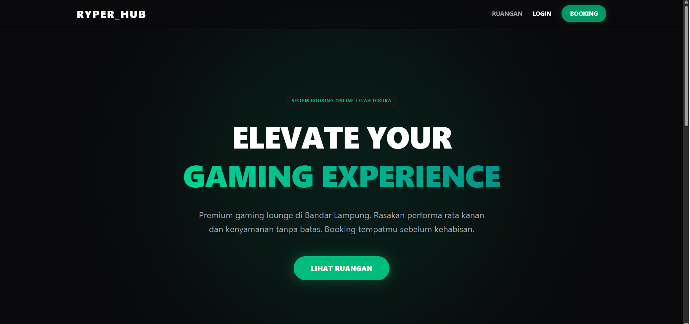
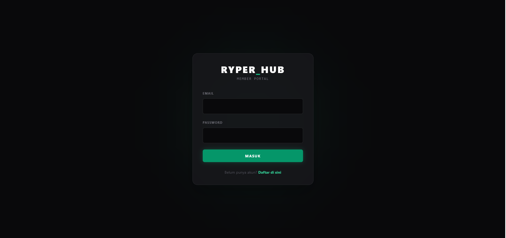
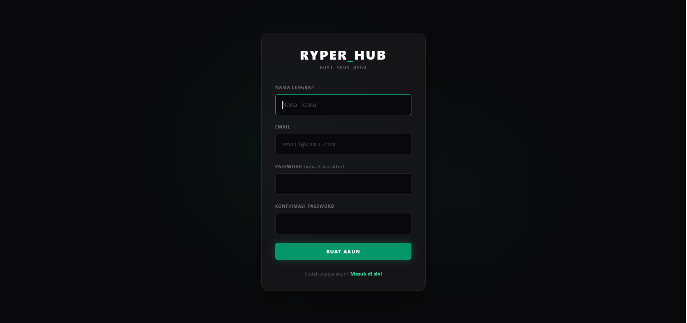
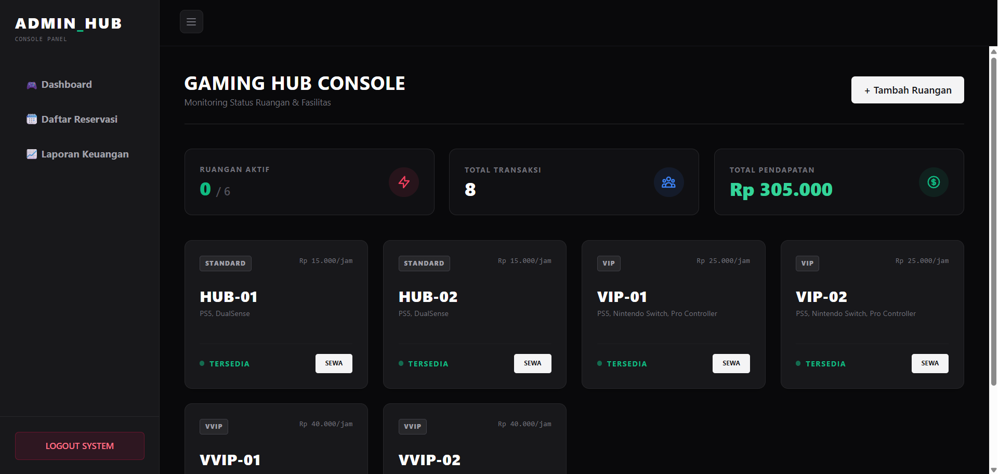
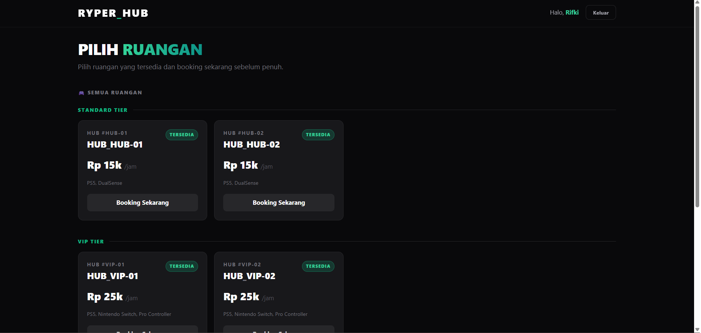

# 🎮 Sistem Manajemen dan Booking Gaming Lounge

Aplikasi web berbasis **Laravel** untuk mengelola dan melakukan booking ruang gaming (VIP & VVIP) di sebuah gaming lounge. Sistem ini mendukung dua peran pengguna: **Admin** dan **Customer**.

---

## 📋 Fitur Utama

### 👑 Admin
- Manajemen data ruangan (nama, tipe, harga per jam)
- Lihat dan kelola semua transaksi booking
- Dashboard statistik penggunaan ruangan

### 🧑‍💻 Customer
- Registrasi & login akun
- Melihat daftar ruangan yang tersedia
- Booking ruangan berdasarkan tanggal, jam mulai, dan durasi
- Memilih fasilitas tambahan (controller, VR, headset, dll.)
- Kalkulasi harga otomatis secara real-time
- Riwayat transaksi pribadi

---

## 🛠️ Teknologi yang Digunakan

| Teknologi | Keterangan |
|-----------|------------|
| **Laravel 10** | PHP Framework (Backend) |
| **MySQL** | Database |
| **Blade** | Template Engine (Frontend) |
| **Bootstrap 5** | CSS Framework |
| **Vite** | Asset Bundler |

---

## ⚙️ Cara Instalasi & Menjalankan

### Prasyarat
- PHP >= 8.1
- Composer
- Node.js & NPM
- MySQL

### Langkah-langkah

```bash
# 1. Clone repository ini
git clone https://github.com/Ryper29/Sistem-Manajemen-dan-Booking-Gaming-Lounge.git
cd Sistem-Manajemen-dan-Booking-Gaming-Lounge

# 2. Install dependensi PHP
composer install

# 3. Install dependensi Node.js
npm install

# 4. Salin file environment dan konfigurasi
cp .env.example .env
php artisan key:generate

# 5. Konfigurasi database di file .env
# Ubah DB_DATABASE, DB_USERNAME, DB_PASSWORD sesuai setup lokal kamu

# 6. Jalankan migrasi dan seeder
php artisan migrate --seed

# 7. Jalankan server development
php artisan serve

# 8. (Terminal terpisah) Jalankan Vite
npm run dev
```

Buka browser dan akses: **http://127.0.0.1:8000**

---

## 🔑 Akun Default (Seeder)

| Peran | Email | Password |
|-------|-------|----------|
| Admin | admin@gaminghub.com | admin123 |
| Customer | rifki123@gmail.com | rifki123 |

---

## 📁 Struktur Utama

```
warnet-vip/
├── app/
│   ├── Http/
│   │   ├── Controllers/       # AuthController, CustomerController, TransactionController, dll.
│   │   └── Middleware/        # EnsureRole (Role-based Access Control)
│   └── Models/                # User, Room, Transaction
├── database/
│   ├── migrations/            # Skema database
│   └── seeders/               # Data awal (Admin, Room, dll.)
├── resources/
│   └── views/                 # Blade templates (admin, customer, auth)
└── routes/
    └── web.php                # Definisi semua route
```

---

## 📸 Tampilan Aplikasi

### 🏠 Halaman Utama (Welcome Page)


### 🔐 Halaman Login


### 📝 Halaman Registrasi


### 👑 Dashboard Admin


### 🎮 Dashboard Customer (Pilih Ruangan)


---

## 📄 Lisensi

Project ini dibuat sebagai **project akademik** dan bersifat open source untuk tujuan pembelajaran.

---

## 👤 Developer

**Rifki Yudika Perdana**  
GitHub: [@Ryper29](https://github.com/Ryper29)
